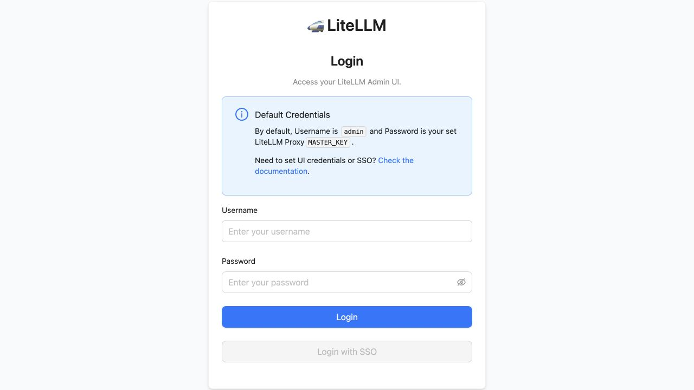

# Guidance for Codex on AWS

Reference access patterns for connecting [OpenAI Codex](https://developers.openai.com/codex/overview) to models on [Amazon Bedrock](https://aws.amazon.com/bedrock/), with corporate SSO, optional quota enforcement, and observability.

---

## Three Customer Rollout Paths

```text
Need hard budgets or centralized routing?
|
|-- NO  -> Native AWS Access with IAM Identity Center
|
`-- YES -> Want to operate the gateway data plane?
           |-- YES -> LiteLLM on ECS
           `-- NO  -> Portkey managed or hybrid
```

| Path | Operations | Identity evidence | Best for |
|---|---|---|---|
| **[IAM Identity Center](docs/QUICKSTART_NATIVE_AWS_ACCESS.md)** | Lowest | Native AWS session and CloudTrail identity | Existing AWS SSO and direct Bedrock access |
| **[LiteLLM on ECS](docs/QUICKSTART_LLM_GATEWAY_LITELLM.md)** | Customer operated | Gateway key/JWT telemetry | Inspectable AWS stack and hard controls |
| **[Portkey](docs/QUICKSTART_LLM_GATEWAY_PORTKEY.md)** | Managed or hybrid | Workspace key/JWT telemetry | Vendor-managed policy, routing, and analytics |

The repository also retains an
[AgentCore Gateway](docs/QUICKSTART_AGENTCORE_GATEWAY.md) pattern for customers
who specifically need AWS-managed routing, Bedrock Guardrails, or AWS-private
web search.

## What LiteLLM Does During a Task

LiteLLM does not deploy or run Codex. Codex stays on the developer machine.
For each turn, Codex sends a Responses request containing task context and tool
definitions. LiteLLM authenticates the developer, applies model and budget
policy, obtains upstream AWS credentials, and forwards the request to Bedrock
Mantle. If the model requests a tool, Codex runs it locally and sends the result
through LiteLLM in the next turn. That loop continues until the model returns a
final response.

```text
Codex -> /v1/responses -> LiteLLM policy -> Bedrock Mantle
  ^                                              |
  `----------- local tool result <--------------'
```

The value is the control point: developers retain the normal Codex experience,
while the platform team gets centralized identity, model access, rate limits,
budgets, and gateway telemetry.

## Live Walkthrough

The LiteLLM reference was deployed and contract-tested in `us-east-1`. The
walkthrough endpoint is CIDR-restricted and intentionally uses HTTP only;
production defaults remain TLS and Multi-AZ.




## Quick Start

- **Overview & decision guide** → [QUICKSTART.md](QUICKSTART.md)
- **Native AWS Access** → [Quickstart](docs/QUICKSTART_NATIVE_AWS_ACCESS.md)
- **AgentCore Gateway** → [Quickstart](docs/QUICKSTART_AGENTCORE_GATEWAY.md)
- **LiteLLM Gateway** → [Primary enterprise walkthrough](docs/QUICKSTART_LLM_GATEWAY_LITELLM.md)
- **Portkey Gateway** → [Managed and hybrid evaluation](docs/QUICKSTART_LLM_GATEWAY_PORTKEY.md)
- **Gateway requirements** → [Pattern requirements](docs/QUICKSTART_LLM_GATEWAY.md)

## Documentation

- [Architecture & pattern comparison](docs/01-decide.md)
- [Enterprise gateway evaluation](docs/ENTERPRISE_GATEWAY_GUIDANCE.md)
- [Production deployment gates](docs/PRODUCTION_DEPLOYMENT.md)
- [Monitoring & operations](docs/operate-monitoring.md)
- [Troubleshooting](docs/operate-troubleshooting.md)
- [CHANGELOG](CHANGELOG.md)

## Client tooling — Codex-native by design

Authentication and telemetry both use features built into Codex.

### Authentication

- **Native AWS Access.** Codex's `amazon-bedrock` provider signs requests with AWS
  SigV4 from the standard credential chain. Developers sign in with `aws sso login`
  (IAM Identity Center).
- **Gateway patterns.** The gateway uses a `CUSTOM_JWT` authorizer, so Codex sends an
  OIDC bearer token from your IdP. Codex refreshes the token automatically when you
  point the provider at a token-fetch `auth` command (model-provider path) or use
  `[mcp_servers.*.oauth]` (MCP path); a static `env_key` token works too if you'd
  rather renew it yourself.

See [daily use](docs/QUICKSTART_AGENTCORE_GATEWAY.md#daily-use) for the day-to-day flow.

### Telemetry

Codex emits OpenTelemetry natively through its `[otel]` config; you point it at a
local collector — the sidecar — that adds the attribution the dashboards run on
(see [operate-monitoring.md](docs/operate-monitoring.md)):

- **Per-user identity** — the sidecar adds `user.id` and `user.email`.
- **Organizational grouping** — it can also add `user.name`, `department`,
  `team.id`, `cost_center`, `organization`, `location`, `role`, and `manager`, so you
  can slice spend and usage by team, department, or cost center.

These are **resource** attributes — the shape the dashboards expect
(`@resource.team.id`, …) and the same keys the collector-free
[bearer-token path](https://docs.aws.amazon.com/AmazonCloudWatch/latest/monitoring/coding-agents-codex-bearer-token.html)
sets via `OTEL_RESOURCE_ATTRIBUTES`. One dashboard works for both the sidecar and the
bearer-token path.

Metric attribution comes from the sidecar, because Codex's `otel.span_attributes`
apply only to traces, not metrics. (You can instead have Codex forward static headers
via `[otel.*].headers` and have the collector lift them into attributes with
`from_context`, but the sidecar is simpler.)

Metric export is gated behind `analytics.enabled`, which `codex exec` and the TUI
default to `true`, so metrics flow out of the box.

**Gateway path caveat:** On the LiteLLM gateway, metric attribution covers the
identity fields LiteLLM puts on metric datapoints: `user.email`, `user.id`,
`team.id`, `organization`, and `model`. The other org fields travel on spans and
logs, so attribute gateway metrics by team or org and join the rest downstream
(CUR / Athena). Full per-attribute metric parity is a local-sidecar capability.

> **SigV4 caveat:** CloudWatch's native OTLP endpoint requires SigV4-signed requests,
> which Codex does not sign directly. Any path that ships Codex's client OTEL to
> CloudWatch runs a standard
> [AWS Distro for OpenTelemetry (ADOT) Collector](https://aws-otel.github.io/) — the
> upstream AWS collector — to sign and forward.
>
> **Two telemetry sources:**
> - **Server-side metrics.** With AgentCore Gateway, AWS records usage telemetry
>   without a collector: GPT-5.x token usage in `AWS/BedrockMantle` (emitted by
>   Bedrock Mantle, the inference layer) and gateway invocation / latency / error
>   metrics in `AWS/Bedrock-AgentCore` (emitted by AgentCore Gateway observability).
> - **Client OTEL (Codex's `[otel]`).** The per-turn / per-tool / per-user signals
>   come from Codex itself and require the ADOT collector above on every pattern,
>   AgentCore included. See [operate-monitoring.md](docs/operate-monitoring.md) for
>   how to wire client OTEL.

### Optional helpers

| Helper / guidance | When it helps |
|-------------------|---------------|
| [aws-oidc-auth/](https://github.com/aws-samples/sample-openai-on-aws/tree/main/aws-oidc-auth) | A `credential_process` helper for organizations that federate a raw OIDC IdP (Okta / Entra ID / Auth0 / Cognito) to AWS without IAM Identity Center. If you use IdC (`aws sso login`) or a gateway with OIDC bearer auth, the default paths already cover you. See [AUTH_HELPER.md](https://github.com/aws-samples/sample-openai-on-aws/blob/main/AUTH_HELPER.md). |
| [deployment/scripts/codex-sso-creds*](deployment/scripts/) | For the Native AWS Access path: a `credential_process` helper script (bash + PowerShell) that makes IAM Identity Center login seamless — it auto-triggers `aws sso login` when the token expires, so the daily loop is just `codex`. Supports macOS, Linux, and Windows, including headless device-code hosts. See [credential-helper-auto-login.md](docs/credential-helper-auto-login.md). |

## Contributing

See [CONTRIBUTING.md](CONTRIBUTING.md) and [CODE_OF_CONDUCT.md](CODE_OF_CONDUCT.md).

## License

This repository is dual-licensed:

- **Code** (`.py`, `.js`, `.ts`, `.go`, configuration files, and other source) is licensed under the [MIT No Attribution (MIT-0)](LICENSE) license.
- **Documentation, media, and text content** (`.md` documentation, images, and diagrams) is licensed under the [Creative Commons Attribution-ShareAlike 4.0 International (CC-BY-SA 4.0)](LICENSE-DOCS.md) license.
