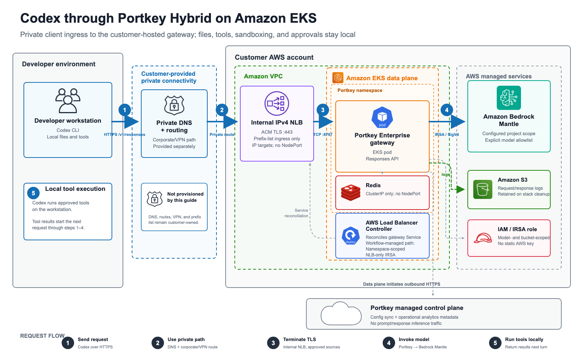

# Portkey Hybrid on Amazon EKS

This directory contains the Portkey Hybrid implementation. For the operator
runbook, start with the [Portkey quickstart](../../docs/QUICKSTART_LLM_GATEWAY_PORTKEY.md).

The deployment runs Portkey's licensed Enterprise gateway in Amazon EKS. Codex
reaches it through a customer-owned private hostname and an internal NLB. The
gateway calls Bedrock Mantle with IRSA and writes request and response logs to
a retained S3 bucket.

The Portkey organization and workspace must be Hybrid-enabled. This baseline
does not implement a fully air-gapped Portkey control plane; that requires
separate Enterprise artifacts and design work.

Portkey's managed control plane remains outside the customer AWS account. The
gateway initiates outbound configuration synchronization and sends operational
analytics metadata such as model choice, token counts, and latency. Prompt and
response inference traffic does not use `api.portkey.ai` as its endpoint.

## Architecture



```text
Codex -> private DNS/routing -> internal NLB TLS :443
      -> gateway pod TCP :8787 -> Bedrock Mantle
```

The NLB accepts traffic only from the configured customer-managed prefix lists.
Redis uses a `ClusterIP` Service. The gateway is the only `LoadBalancer`
Service, and neither Service allocates a NodePort.

## Responsibility boundary

| Component | Owner | Notes |
| --- | --- | --- |
| Optional sandbox EKS cluster | This workflow | Two `t4g.medium` managed nodes; use only for evaluation |
| AWS Load Balancer Controller | This workflow or cluster owner | The included path is pinned and watches the Portkey namespace |
| S3 log bucket and gateway IAM policy | CloudFormation | Bucket is encrypted, versioned, lifecycle-managed, and retained on deletion |
| Gateway service account and IRSA role | `eksctl` | Created only after fail-closed ownership checks |
| Gateway, Redis, Secrets, and NLB Service | Helm | Helm reuses the `eksctl`-managed gateway service account |
| ACM certificate, hostname, routing/resolver path, and prefix lists | Customer | Prepare before deployment; never deleted by this workflow |
| Private DNS record | Customer | Create after `portkey-status` reports the NLB target; never deleted by this workflow |
| Enterprise entitlement, image credentials, license, and image digests | Portkey/customer | Supplied out of band |
| Model Catalog provider and Workspace Service API key | Portkey workspace owner | Created after the gateway IRSA role exists |
| Optional inbound or outbound PrivateLink | Customer and Portkey | Vendor-assisted customization; not created here |

## Files

| File | Purpose |
| --- | --- |
| `.env.deploy.example` | Configuration template; copy to the ignored `.env.deploy` |
| `eksctl-cluster.yaml.tmpl` | Optional evaluation EKS cluster |
| `hybrid-infrastructure.yaml` | Retained S3 bucket and gateway managed IAM policy |
| `lbc-iam-policy.json.tmpl` | NLB-only, version-matched controller policy |
| `values.yaml.tmpl` | Portkey chart values and private NLB annotations |
| `portkey-post-renderer.sh` | Adds `allocateLoadBalancerNodePorts: false` to the exact gateway Service |
| `../scripts/portkey-stack.sh` | Plan, deploy, validate, status, and cleanup driver |
| `../scripts/tests/test_gateway_tools.py` | Shell workflow and guardrail tests |
| `../scripts/tests/test_portkey_chart_render.py` | Real pinned-chart manifest test |

The driver requires `.env.deploy` mode `0600` or `0400`. It does not blanket
export secrets. Helm secrets are written only to a mode-`0600` temporary file.

## Command reference

Infrastructure commands separate inspection from changes:

| Phase | Inspect or plan | Change state |
| --- | --- | --- |
| Sandbox EKS | `make portkey-cluster-plan` | `CONFIRM_AWS_WRITE=1 make portkey-cluster-deploy` |
| Load balancer controller | `make portkey-lbc-plan`, `make portkey-lbc-status` | `CONFIRM_AWS_WRITE=1 make portkey-lbc-deploy` |
| AWS gateway resources | `make portkey-aws-check`, `make portkey-aws-plan` | `CONFIRM_AWS_WRITE=1 make portkey-aws-deploy` |
| Gateway Helm release | `make portkey-helm-plan`, `make portkey-status` | `CONFIRM_AWS_WRITE=1 make portkey-helm-deploy` |
| Gateway cleanup | `make portkey-aws-cleanup-plan` | `CONFIRM_STACK_DELETE=<stack> make portkey-aws-cleanup` |
| Controller cleanup | `make portkey-lbc-cleanup-plan` | `CONFIRM_LBC_DELETE=<cluster> make portkey-lbc-cleanup` |
| Sandbox cluster cleanup | None | `CONFIRM_CLUSTER_DELETE=<cluster> make portkey-cluster-cleanup` |

Client commands do not change infrastructure, but the live checks contact the
gateway:

| Class | Commands | Effect |
| --- | --- | --- |
| Local configuration | `make portkey-check`, `make portkey-codex-config` | Validate settings or print configuration without making an inference request |
| Live authentication check | `make portkey-auth-negative` | Send deliberately invalid credentials and require HTTP 401 or 403 |
| Live contract checks | `make portkey-validate`, `make portkey-codex-validate` | Make billable model requests and write Portkey, S3, and stored Mantle response data |

For a new sandbox:

```bash
make portkey-cluster-plan
CONFIRM_AWS_WRITE=1 make portkey-cluster-deploy

make portkey-aws-check
make portkey-aws-plan
CONFIRM_AWS_WRITE=1 make portkey-aws-deploy

make portkey-helm-plan
CONFIRM_AWS_WRITE=1 make portkey-helm-deploy
make portkey-status
```

For an existing cluster, skip the cluster commands and prepare the controller
before Helm:

```bash
make portkey-lbc-plan
CONFIRM_AWS_WRITE=1 make portkey-lbc-deploy
make portkey-lbc-status
```

An externally managed controller requires the command-scoped
`PORTKEY_EXTERNAL_LBC_POLICY_CONFIRMED=true` attestation for `lbc-deploy`,
`lbc-status`, and `helm-deploy`. Never persist that value.

## Configuration contract

Copy the example before running any command:

```bash
install -m 600 deployment/portkey/.env.deploy.example \
  deployment/portkey/.env.deploy
```

| Settings | Used for |
| --- | --- |
| `AWS_REGION` | EKS, CloudFormation, S3, NLB, and controller resources |
| `BEDROCK_MANTLE_REGION` | Portkey provider endpoint and gateway IAM Region condition |
| `PORTKEY_CLUSTER_NAME`, `PORTKEY_NAMESPACE`, `PORTKEY_SERVICE_ACCOUNT`, `PORTKEY_STACK_NAME`, `PORTKEY_HELM_RELEASE` | Deterministic ownership and cleanup targets |
| `PORTKEY_HELM_CHART_VERSION`, `PORTKEY_LBC_HELM_CHART_VERSION`, `PORTKEY_INTERNAL_NLB` | Pinned chart contracts and the required private NLB mode |
| `PORTKEY_GATEWAY_HOSTNAME` | Private client hostname and certificate SAN check |
| `PORTKEY_NLB_TLS_CERTIFICATE_ARN` | Existing issued ACM certificate in `AWS_REGION` |
| `PORTKEY_NLB_ALLOWED_PREFIX_LIST_IDS` | Approved private client source networks |
| `PORTKEY_DOCKER_USERNAME`, `PORTKEY_DOCKER_PASSWORD`, `PORTKEY_CLIENT_AUTH`, `PORTKEY_ORGANIZATION_ID` | Private registry access and licensed gateway configuration |
| `PORTKEY_GATEWAY_IMAGE_TAG`, `PORTKEY_GATEWAY_IMAGE_DIGEST`, `PORTKEY_REDIS_IMAGE_TAG`, `PORTKEY_REDIS_IMAGE_DIGEST` | Immutable workload image references |
| `BEDROCK_MANTLE_PROJECT_ID` and `PORTKEY_ALLOWED_MODELS` | Gateway IAM scope |
| `PORTKEY_PROVIDER_SLUG`, `PORTKEY_MODEL`, `PORTKEY_API_KEY` | Client configuration and live checks |
| `PORTKEY_BASE_URL` | Durable HTTPS endpoint; blank selects the local diagnostic tunnel |

`AWS_REGION` and `BEDROCK_MANTLE_REGION` may differ, but both must be in the
same AWS partition. A provider belongs to one Mantle Region. Separate clusters
are the default for additional Regions. On an intentionally shared existing
cluster, give each Region a unique stack, namespace, service account, and Helm
release, and use a pre-existing compatible controller that watches all
namespaces. The included namespace-scoped controller cannot serve two regional
deployments. Do not reuse a provider slug across Regions. Redeploying one stack
changes its regional and model IAM scope; it does not add simultaneous access
to another Region.

Static checks validate the provider slug and model membership, but cannot read
the provider Region from Portkey. Confirm it in Model Catalog and use
CloudTrail `CreateInference` events in `BEDROCK_MANTLE_REGION` as live evidence.

Helm plan and deployment require both approved image pairs:

```dotenv
PORTKEY_GATEWAY_IMAGE_TAG=replace-with-approved-version
PORTKEY_GATEWAY_IMAGE_DIGEST=sha256:0000000000000000000000000000000000000000000000000000000000000000
PORTKEY_REDIS_IMAGE_TAG=replace-with-approved-patch-version
PORTKEY_REDIS_IMAGE_DIGEST=sha256:0000000000000000000000000000000000000000000000000000000000000000
```

The workflow rejects gateway aliases such as `latest`, `edge`, and
`main-latest`. Kubernetes receives `repository:<tag>@<digest>` and therefore
pulls by digest. The operator remains responsible for approving the tag/digest
pair, verifying the publisher, and confirming ARM64 compatibility for the
included `t4g` nodes.

## How the guardrails work

### Gateway service-account ownership

The gateway service account and deterministic `eksctl` IAM stack are treated
as one ownership unit:

| Observed state | Result |
| --- | --- |
| Both absent | Create without `--override-existing-serviceaccounts`, then verify |
| Both present and verified | Reuse; skip service-account creation and allow the IAM policy update |
| Only one present | Stop before mutation |
| Stack, role, trust, policy, annotation, or reads do not match | Stop before mutation |

Verification covers the `managed-by=eksctl` label, deterministic stack tags and
output, role annotation, live role, OIDC issuer/audience/subject trust, absence
of unexpected role policies or a permissions boundary, and the expected
managed-policy attachment.

This proof does not extend to a same-named main CloudFormation stack or Helm
release. Operators must verify those names separately before deployment or
cleanup.

### AWS Load Balancer Controller

The included controller path is pinned to chart 3.4.2 and matched to
`lbc-iam-policy.json.tmpl`. The policy permits only internal NLB resources in
`AWS_REGION`, scopes mutable resources to the selected account, VPC, and
cluster tags, and includes the TLS listener-certificate operations used by the
pinned controller.

The workflow-managed path verifies Helm ownership, service account, IAM stack,
trust, live policy, image, Region/VPC arguments, feature gates, and namespace
scope. Before changing a legacy controller policy it requires zero dependent
LoadBalancer Services, Ingresses, Gateways, and `TargetGroupBinding` objects.
Before any managed controller policy update, it also validates the hostname,
issued same-account/Region ACM certificate and SAN, and active prefix lists and
entries; a failed TLS input check stops before the policy mutation.

The external-controller path is deliberately different. It checks the
compatible Deployment shape, the TLS permission subset, and that exactly one
OIDC issuer/audience/service-account trust statement matches the expected
values. It permits additional trust statements or principals and a permissions
boundary, and therefore cannot prove sole trust, complete base
NLB/security-group permissions, or effective authorization after boundaries
and SCPs. The cluster owner must review and attest to those controls.

Use `eksctl` 0.229.0 or newer generally. Exact 0.229.0 is required only when the
workflow creates the sandbox or creates or updates its managed controller IAM
stack. Helm 3 is required; CI uses 3.21.4.

### Kubernetes service surface

The rendered gateway Service must be:

```yaml
spec:
  type: LoadBalancer
  allocateLoadBalancerNodePorts: false
  ports:
    - name: gateway
      port: 443
      targetPort: gateway
```

The Service annotations require an internal IPv4 NLB, IP targets, ACM TLS on
443, TCP to the gateway, HTTP health checks on port 8787, and prefix-list-only
frontend ingress. Conflicting source ranges, custom frontend security groups,
proxy protocol, external IPs, Ingresses, and Gateway API exposure fail closed.

The chart does not expose `allocateLoadBalancerNodePorts`, so the same
`portkey-post-renderer.sh` is mandatory for `helm template` and
`helm upgrade --install`. Redis is explicitly rendered as `ClusterIP`.

On an existing verified TLS/IP-target Service, a confirmed deployment removes
an allocated gateway `nodePort` and disables future allocation in one patch.
Unexpected Service shapes are not modified.

These checks run during plan and deployment; they are not a permanent policy
engine. Restrict Kubernetes RBAC for gateway Service mutations, and use an
admission policy to keep the internal scheme, TLS listener, certificate,
prefix-list, health-check, backend-security-group, and no-extra-exposure rules
in place after deployment. Operators who only inspect status need read access.

### Secrets and images

The driver checks required values without printing them. It rejects a
group/world-readable environment file, keeps Helm values in a private temporary
file, and scans command construction in tests to prevent secret values from
appearing in arguments.

Image digests provide immutable content identity. They do not prove signature
authenticity. Roll back by restoring previously approved tag/digest pairs and
running the normal Helm plan and deployment, not by selecting a pre-digest
Helm revision.

### Validation

The client checks have distinct scopes:

| Command | What it proves |
| --- | --- |
| `make portkey-check` | Local configuration is internally consistent |
| `make portkey-codex-config` | Prints the durable HTTPS Codex provider block |
| `make portkey-auth-negative` | Deliberately invalid bearer and `x-portkey-api-key` credentials are rejected |
| `make portkey-validate` | Every allowlisted model passes Responses, reasoning, continuation, SSE, and tool-call checks |
| `make portkey-codex-validate` | The selected model completes an isolated Codex file/tool workflow |

`portkey-codex-config` prints a block; it does not edit the user-level Codex
configuration. That block reads `PORTKEY_API_KEY` from the Codex process
environment. Inject only that key through an approved secret manager or
credential helper. Do not source `.env.deploy`, which also contains registry
credentials and the gateway license. The isolated `portkey-codex-validate`
command does not prove that the user's installed configuration can read the
key; run the user-level smoke test in the quickstart as well.

When `PORTKEY_BASE_URL` is blank, live checks use
`http://127.0.0.1:18787/v1` through `kubectl port-forward`. That diagnostic
bypasses the NLB, TLS, DNS, frontend security group, prefix lists, and private
routing. It cannot replace the durable HTTPS acceptance tests in the
quickstart.

After a tunnel-only diagnostic, set the private HTTPS base URL and rerun the
three live checks from an approved routed client. The strict model probe uses
`store=true`; stored Mantle Responses have the documented 30-day retention
period, in addition to data written to the retained S3 bucket and Portkey logs.
Do not send data that policy forbids those stores from retaining.

Complete S3-backed evidence in Portkey's managed dashboard requires the
separate inbound PrivateLink path described below. Basic inference and the
local diagnostic do not require that path.

## AWS resources and model scope

`hybrid-infrastructure.yaml` creates:

- an encrypted and versioned S3 bucket for request and response logs;
- a lifecycle that expires current objects after 30 days and noncurrent
  versions seven days after they become noncurrent; and
- a managed policy for that bucket and the configured Bedrock Mantle scope.

The bucket has `DeletionPolicy: Retain`.

The initial walkthrough uses:

```dotenv
BEDROCK_MANTLE_PROJECT_ID=*
PORTKEY_ALLOWED_MODELS=openai.gpt-5.5
```

After CloudTrail identifies the actual project, replace `*` with the observed
`proj_...` ID, or `default`, and redeploy. Every model in the comma-separated
allowlist becomes an IAM condition value and must pass the strict probe. Codex
selects exactly one of them through
`PORTKEY_MODEL=@<provider-slug>/<model-id>`; no fallback is configured.
Passing the supported-Region preflight does not prove that a model is available
there; live validation is the availability test.

## Network requirements

| Source | Required destination |
| --- | --- |
| Worker/container runtime | Docker Hub endpoints for the hard-coded gateway and Redis repositories |
| Gateway pod | `api.portkey.ai`, `albus.portkey.ai`, AWS STS, S3 in `AWS_REGION`, and the Mantle endpoint in `BEDROCK_MANTLE_REGION` |
| Codex client | Customer private DNS and routing to the internal NLB |

Restricted clusters need NAT or supported service-specific VPC endpoints.
Repository overrides for an image mirror are not exposed and require a
reviewed values-template change.

Outbound Portkey PrivateLink needs vendor-assisted onboarding and additional
`ALBUS_BASEPATH`, `CONTROL_PLANE_BASEPATH`, `SOURCE_SYNC_API_BASEPATH`, and
`CONFIG_READER_PATH` settings that this template does not expose. The separate
inbound PrivateLink path used for complete managed dashboard log visibility is
also vendor-assisted. The baseline creates neither. Do not widen NLB ingress
or disable frontend security-group enforcement to make a PrivateLink path
work.

## Existing deployments

### Legacy plaintext NLB

A port-80 NLB is replaced, not edited in place. Record its ARN and inventory
every DNS/client, ALB/proxy, `TargetGroupBinding`, and endpoint-service
dependency before changing it.

Stop and coordinate with the relevant owner when:

- a Portkey inbound PrivateLink endpoint service references the old NLB;
  coordinate the new NLB association and possible connection reapproval with
  Portkey;
- an ALB, reverse proxy, DNS record, or client still uses the old endpoint;
  validate native NLB TLS before removing customer-owned proxying, and never
  open port 443 to `0.0.0.0/0` or `::/0` as a workaround;
- the load-balancer controller or its IAM role is shared; or
- the old NLB cannot be deleted cleanly; resolve its Service,
  `TargetGroupBinding`, DNS, and PrivateLink dependencies instead of forcing
  cleanup.

The local port-forward uses the gateway Service. It remains available before
deletion, then stops until Helm creates the replacement Service; direct pod
forwarding would be a separate manual diagnostic. Schedule a maintenance
window and notify endpoint users. The private endpoint is unavailable from
Service deletion until the old NLB is gone, the controller policy is updated,
the new NLB is healthy, and DNS is repointed.

The safe order is:

1. Run `make portkey-helm-plan` with the TLS settings and its ACM/prefix-list
   checks. Delete nothing if the plan fails.
2. Delete only the legacy gateway Service and wait for the old NLB to
   disappear. Helm is not a continuous reconciler and will not recreate the
   Service between commands.
3. Update the workflow-managed controller policy:

   ```bash
   CONFIRM_AWS_WRITE=1 make portkey-lbc-deploy
   ```

4. Deploy the TLS Service, wait for the new NLB, validate the listener,
   certificate, target health, and approved-client HTTPS path, and only then
   repoint private DNS:

   ```bash
   CONFIRM_AWS_WRITE=1 make portkey-helm-deploy
   make portkey-status
   ```

This migration has endpoint downtime. Keep the legacy TCP controller policy
until the old NLB is gone so recovery can still recreate or modify its
listener.

### Certificate or prefix-list rotation

After reviewing `make portkey-helm-plan`, use a command-scoped confirmation:

```bash
CONFIRM_PORTKEY_NLB_TLS_UPDATE=portkeyai/portkey-ai-gateway \
  CONFIRM_AWS_WRITE=1 make portkey-helm-deploy
```

For custom names, use `<namespace>/<helm-release>-gateway`. Never persist the
confirmation. Prefix-list contents can change without a Git or Helm diff, so
protect them with network change control and monitoring.

## Cleanup behavior

The examples below use the default names. Replace the stack or cluster
confirmation value with the matching value from `.env.deploy` when customized.

Remove the gateway before the controller or sandbox cluster:

```bash
make portkey-aws-cleanup-plan
CONFIRM_STACK_DELETE=codex-portkey-hybrid make portkey-aws-cleanup
```

The cleanup plan calls `portkey-status`, so the main CloudFormation stack and a
verified gateway service-account/`eksctl` stack pair must still exist. Cleanup
then removes the named Helm release, rechecks that pair, deletes it with
`eksctl`, and deletes the main stack. The script cannot prove ownership of a
same-named Helm release or main stack; verify both before confirming deletion.
If a step fails after an earlier deletion, inspect the remaining resources and
recover with their owner before retrying. This is not an automatic resume
workflow.

For a controller installed on an existing cluster and used only by Portkey:

```bash
make portkey-lbc-cleanup-plan
CONFIRM_LBC_DELETE=codex-portkey make portkey-lbc-cleanup
```

Controller cleanup refuses a controller that is not owned by this workflow or
still has a `TargetGroupBinding`, LoadBalancer Service, Ingress, or Gateway
dependency. Those checks cannot determine whether an otherwise idle controller
is reserved for another team, so the cluster owner must also confirm that it is
not shared. `TargetGroupBinding` objects are always checked across all
namespaces; when the controller Deployment is absent, Service, Ingress, and
Gateway checks also expand to all namespaces. The workflow probes the
deterministic `eksctl` stack and, after approved deletion, verifies that the IAM
stack disappeared. A surviving stack without the matching managed service
account is treated as an orphan and requires owner-assisted recovery or manual
cleanup.

Delete the included sandbox only after gateway cleanup:

```bash
CONFIRM_CLUSTER_DELETE=codex-portkey make portkey-cluster-cleanup
```

`cluster-cleanup` deletes the configured cluster and does not prove walkthrough
ownership. Never use it for a shared cluster.

The retained S3 bucket, ACM certificate, prefix lists, DNS, VPN, routes,
resolver rules, customer proxies, and Portkey-assisted PrivateLink resources
remain. Review and remove them through their owning workflows.

## Tests

Run the focused deployment tests with Helm 3 on `PATH`:

```bash
python3 -m unittest discover \
  -s deployment/scripts/tests \
  -p 'test_*.py' \
  -v

python3 deployment/scripts/validate-doc-links.py
git diff --check
```

The chart-render test uses the pinned Portkey chart and verifies the TLS/NLB
annotations, Redis `ClusterIP`, absence of NodePorts, and digest-qualified
images.
