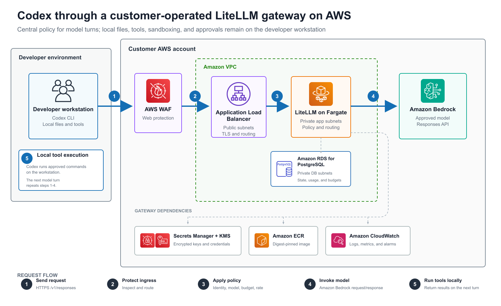
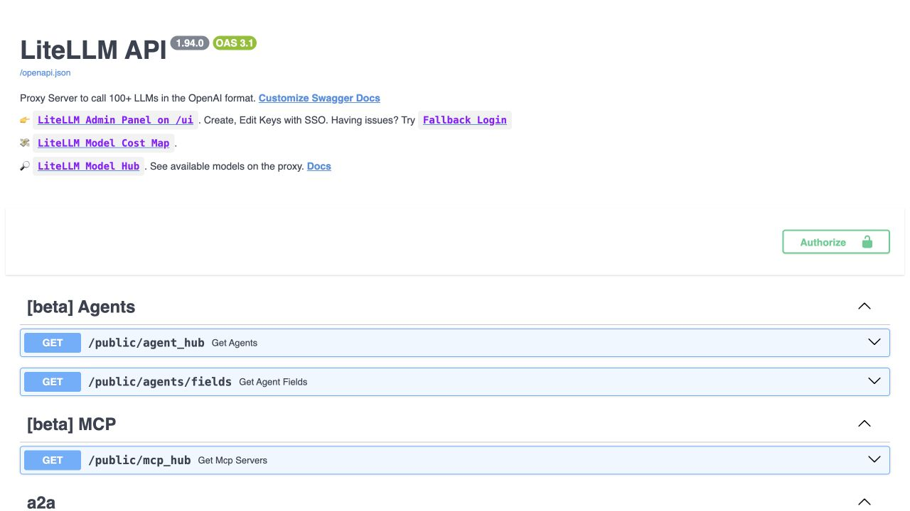
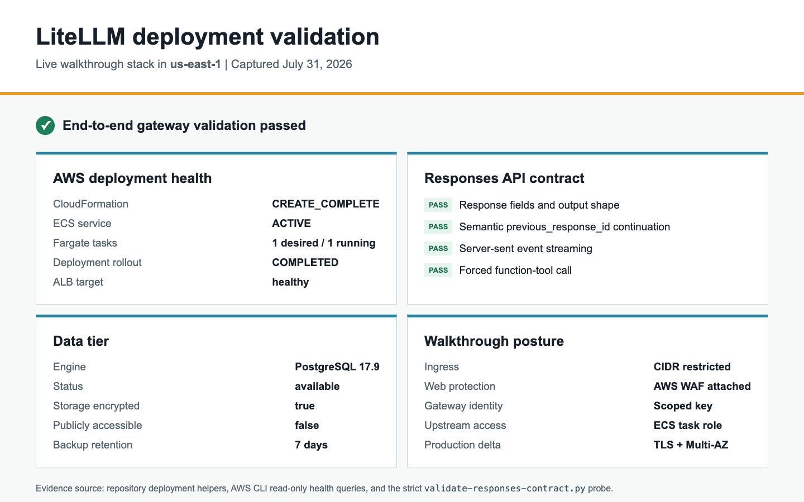

# Quick Start: LiteLLM Gateway on AWS

> **Status:** Hardened reference baseline
> **Audience:** Organizations evaluating LLM gateway patterns, learning CloudFormation deployment  
> **Production Readiness:** Requires customer landing-zone validation and recorded production evidence (see [Security Considerations](#security-considerations))

Deploy a LiteLLM gateway on ECS Fargate and connect Codex to an Amazon Bedrock
backend. This is the repository's primary enterprise implementation of the
[LLM Gateway pattern](QUICKSTART_LLM_GATEWAY.md).

## What the Deployment Looks Like

The reference flow keeps the Codex task loop on the developer workstation and
places model authentication, policy, routing, and telemetry in the customer
AWS account.



The following images are from the live `us-east-1` walkthrough. The API
surface confirms the deployed proxy is reachable, and the validation summary
records stack health plus the Responses contract checks.





**Features:**
- Per-user and per-team budget limits (`max_budget`, `budget_duration`)
- Rate limiting (RPM and TPM controls)
- Model routing and fallback
- Admin API for key generation
- Optional OIDC self-service portal
- CloudWatch metrics via OpenTelemetry

---

## Prerequisites

- AWS account with admin permissions (ECS, VPC, ALB, RDS, CloudFormation, ECR, Secrets Manager)
- Amazon Bedrock activated in target region (this walkthrough uses `us-east-1`)
- AWS CLI v2 installed and authenticated
- Docker installed and running
- [Codex CLI](https://developers.openai.com/codex/cli) installed
- A public Route 53 hosted zone, or an existing ACM certificate in the deployment Region
- A DNS name in that zone for the trusted Codex HTTPS endpoint

---

## Deployment

### Automated Path

The Make targets wrap the detailed commands below and never push git changes:

```bash
cp deployment/litellm/.env.deploy.example deployment/litellm/.env.deploy
# Edit the gitignored file with your profile, DNS, and CIDR.

make litellm-check
CONFIRM_AWS_WRITE=1 make litellm-build
make litellm-plan
CONFIRM_AWS_WRITE=1 make litellm-deploy
```

After the stack is healthy:

```bash
CONFIRM_AWS_WRITE=1 make litellm-provision-key
make litellm-codex-config
make litellm-validate
```

`litellm-plan` creates a non-executed change set. On the first deployment it
plans networking first; apply networking before planning the dependent gateway
stack. The one-command `litellm-deploy` deploys both stacks sequentially and
requires the explicit write confirmation shown above. `litellm-provision-key`
creates a model-scoped LiteLLM key, writes it to Secrets Manager without
printing it, and records only the secret ID in the gitignored deployment state.

The deployment creates billable resources, including an Application Load
Balancer, ECS tasks, RDS, NAT gateways when the sample VPC is used, WAF, logs,
and model inference. Review current prices for your Region and clean up a
walkthrough promptly.

### Step 1: Clone and Set Variables

```bash
git clone https://github.com/openai-on-aws/guidance-codex.git
cd guidance-codex

export AWS_REGION=us-east-1
export BEDROCK_REGION=us-east-1
export AWS_ACCOUNT_ID=$(aws sts get-caller-identity --query Account --output text)
export ECR_REGISTRY="$AWS_ACCOUNT_ID.dkr.ecr.$AWS_REGION.amazonaws.com"
export ALLOWED_CIDR="$(curl -Ls https://checkip.amazonaws.com)/32"
# Optional when browser, VPN, and terminal traffic use different egress IPs:
# export ADDITIONAL_ALLOWED_CIDR_1=198.51.100.8/32
# export ADDITIONAL_ALLOWED_CIDR_2=192.0.2.16/32
export LITELLM_BASE_IMAGE=ghcr.io/berriai/litellm@sha256:65d84a2282137b4dc73bbe184650a7c807177c533e4223b3bfbc87963fe3fabe
export GATEWAY_DOMAIN_NAME=gateway.example.com
export ROUTE53_HOSTED_ZONE_ID=Z0123456789EXAMPLE

# Alternatively, use an existing certificate and omit ROUTE53_HOSTED_ZONE_ID:
# export ALB_CERTIFICATE_ARN=arn:aws:acm:us-east-1:123456789012:certificate/replace-me

# Read-only checks before building.
python3 deployment/scripts/preflight-litellm.py --stage build
```

### Step 2: Build and Push LiteLLM Image

```bash
# Create ECR repository
export LITELLM_REPO=codex-litellm
aws ecr create-repository \
  --repository-name "$LITELLM_REPO" \
  --region "$AWS_REGION" \
  --image-scanning-configuration scanOnPush=true \
  || echo "Repository already exists"

# Authenticate Docker to ECR
aws ecr get-login-password --region "$AWS_REGION" \
  | docker login --username AWS --password-stdin "$ECR_REGISTRY"

# Build and push. The upstream digest was resolved and reviewed in Step 1.
export LITELLM_IMAGE_TAG=v1
export LITELLM_IMAGE_TAGGED="$ECR_REGISTRY/$LITELLM_REPO:$LITELLM_IMAGE_TAG"

docker buildx create --use --name codex-builder 2>/dev/null || true
docker buildx build \
  --platform linux/amd64,linux/arm64 \
  --build-arg LITELLM_BASE_IMAGE="$LITELLM_BASE_IMAGE" \
  --tag "$LITELLM_IMAGE_TAGGED" \
  --file deployment/litellm/Dockerfile \
  --push \
  deployment/litellm
```

**For single-arch (faster, recommended on Apple Silicon):**
```bash
docker buildx build \
  --builder codex-builder \
  --platform linux/amd64 \
  --build-arg LITELLM_BASE_IMAGE="$LITELLM_BASE_IMAGE" \
  --tag "$LITELLM_IMAGE_TAGGED" \
  --file deployment/litellm/Dockerfile \
  --push \
  deployment/litellm
```

After either build, resolve the immutable ECR digest used by CloudFormation:

```bash
export LITELLM_IMAGE_DIGEST=$(aws ecr describe-images \
  --repository-name "$LITELLM_REPO" \
  --image-ids imageTag="$LITELLM_IMAGE_TAG" \
  --region "$AWS_REGION" \
  --query 'imageDetails[0].imageDigest' \
  --output text)
export LITELLM_IMAGE="$ECR_REGISTRY/$LITELLM_REPO@$LITELLM_IMAGE_DIGEST"

# Read-only checks before creating or updating stacks.
python3 deployment/scripts/preflight-litellm.py \
  --stage deploy \
  --check-ecr-image
```

### Step 3: Deploy Networking

```bash
export NETWORKING_STACK=codex-networking

aws cloudformation deploy \
  --stack-name "$NETWORKING_STACK" \
  --template-file deployment/infrastructure/networking.yaml \
  --region "$AWS_REGION" \
  --parameter-overrides VpcCidr=10.0.0.0/16
```

To reuse an existing VPC, deploy the same export adapter with two public
subnets in different availability zones:

```bash
aws cloudformation deploy \
  --stack-name "$NETWORKING_STACK" \
  --template-file deployment/infrastructure/networking.yaml \
  --region "$AWS_REGION" \
  --parameter-overrides \
      ExistingVpcId="$EXISTING_VPC_ID" \
      ExistingPublicSubnet1="$EXISTING_PUBLIC_SUBNET_1" \
      ExistingPublicSubnet2="$EXISTING_PUBLIC_SUBNET_2"
```

The existing subnets must have routes to an internet gateway for the
internet-facing ALB. For production, use the separate ALB, task, and database
subnet parameters described in `docs/PRODUCTION_DEPLOYMENT.md`.

### Step 4 (Optional): Gateway telemetry

For CloudWatch metrics on the gateway path, the LiteLLM gateway emits its own
telemetry via the collector config at
`deployment/litellm/otel-collector-config.yaml`, visualized by
`deployment/infrastructure/litellm-dashboard.yaml`. Keep `EnableOtel="false"` in
Step 6 unless you have wired up a collector endpoint the gateway can export to.

### Step 5 (Optional): Deploy User-Key-Mapping for OIDC

Only if enabling OIDC self-service:

```bash
export USERKEY_STACK=codex-user-key-mapping

aws cloudformation deploy \
  --stack-name "$USERKEY_STACK" \
  --template-file deployment/litellm/ecs/user-key-mapping.yaml \
  --capabilities CAPABILITY_NAMED_IAM \
  --region "$AWS_REGION" \
  --parameter-overrides TableName=codex-user-keys
```

### Step 6: Deploy LiteLLM Gateway

```bash
export GATEWAY_STACK=codex-litellm-gateway

# Deploy gateway (references networking stack via imports)
aws cloudformation deploy \
  --stack-name "$GATEWAY_STACK" \
  --template-file deployment/litellm/ecs/litellm-ecs.yaml \
  --capabilities CAPABILITY_NAMED_IAM \
  --region "$AWS_REGION" \
  --parameter-overrides \
      NetworkingStackName="$NETWORKING_STACK" \
      EnableOtel="false" \
      DBUsername=litellm \
      AwsRegion="$BEDROCK_REGION" \
      LiteLLMImage="$LITELLM_IMAGE" \
      AlbDomainName="$GATEWAY_DOMAIN_NAME" \
      Route53HostedZoneId="$ROUTE53_HOSTED_ZONE_ID" \
      AllowedCidr="$ALLOWED_CIDR" \
      EnableJwtMiddleware="false"

# To reuse an existing certificate, replace Route53HostedZoneId with:
#     AlbCertificateArn="$ALB_CERTIFICATE_ARN"
#
# If you deployed Step 4, also add:
#     OtelStackName="$OTEL_STACK"
#     EnableOtel="true"

# Get gateway URL
export GATEWAY_URL=$(aws cloudformation describe-stacks \
  --stack-name "$GATEWAY_STACK" --region "$AWS_REGION" \
  --query 'Stacks[0].Outputs[?OutputKey==`GatewayEndpoint`].OutputValue' --output text)
export GATEWAY_ADMIN_URL=$(aws cloudformation describe-stacks \
  --stack-name "$GATEWAY_STACK" --region "$AWS_REGION" \
  --query 'Stacks[0].Outputs[?OutputKey==`GatewayAdminEndpoint`].OutputValue' --output text)

echo "Gateway URL: $GATEWAY_URL"

export LITELLM_SECRET_ARN=$(aws cloudformation describe-stacks \
  --stack-name "$GATEWAY_STACK" --region "$AWS_REGION" \
  --query 'Stacks[0].Outputs[?OutputKey==`LiteLLMSecretArn`].OutputValue' --output text)
```

For a short-lived walkthrough when no trusted DNS name is available, the
automation supports a raw ALB HTTP endpoint:

```bash
export ENABLE_TLS=false
export GATEWAY_DOMAIN_NAME=
export ROUTE53_HOSTED_ZONE_ID=
export ALB_CERTIFICATE_ARN=
export ALLOWED_CIDR="$(curl -fsS https://checkip.amazonaws.com)/32"
export DB_MULTI_AZ=false
CONFIRM_AWS_WRITE=1 make litellm-deploy
```

This mode remains protected by the configured `/32`, API-key authentication,
and optional WAF, but it does not encrypt client-to-ALB traffic. Use it only to
capture a temporary walkthrough, then delete the stack. Staging and production
must keep `EnableTls=true`.

Managed browsers, VPNs, and terminal tools can use different egress paths even
on the same workstation. If `curl` succeeds but a browser times out, compare
the public IP reported from each client and use the two optional additional
CIDR settings for exact `/32` entries. Do not broaden access to `0.0.0.0/0`.
Some enterprise browser controls also block raw HTTP ALB URLs; use trusted DNS,
ACM, and the HTTPS listener on port 443 for customer deployments. Never expose
the ECS task port 4000 or PostgreSQL port 5432 publicly.

The bundled LiteLLM image routes its OpenAI-compatible Responses traffic to
`https://bedrock-runtime.<region>.amazonaws.com/openai/v1` and uses the Global
cross-Region GPT-5.6 profile IDs. The entrypoint refreshes the per-request
Runtime bearer token in-process from the gateway task role using the official
`aws-bedrock-token-generator` package, rather than injecting a static token.

With `Route53HostedZoneId`, CloudFormation creates and DNS-validates the ACM
certificate and creates the ALB alias record. With `AlbCertificateArn`, the
certificate is reused; create the matching DNS alias in your existing DNS
workflow.

---

## Developer Configuration

### Get API Key

#### Option A: Admin-Generated Keys

```bash
# Add these to the gitignored deployment/litellm/.env.deploy file:
CODEX_API_SECRET_ID=codex-litellm-gateway/alice-key
CODEX_KEY_ALIAS=alice@company.com
CODEX_KEY_USER_ID=alice@company.com
CODEX_KEY_MODELS=gpt-5.6-sol,gpt-5.6-terra,gpt-5.6-luna
CODEX_KEY_MAX_BUDGET=50
CODEX_KEY_BUDGET_DURATION=30d
CODEX_KEY_TPM_LIMIT=100000
CODEX_KEY_RPM_LIMIT=1000

CONFIRM_AWS_WRITE=1 make litellm-provision-key
```

The helper generates the key through the LiteLLM Admin API and writes it
directly to a KMS-encrypted Secrets Manager secret. Neither the LiteLLM master
key nor the generated key is printed.

#### Option B: Self-Service OIDC

If you deployed with `EnableJwtMiddleware=true`, see [deployment/litellm/jwt-middleware/README.md](../deployment/litellm/jwt-middleware/README.md) for OIDC setup.

### Codex Configuration

Developers add this to the user-level `~/.codex/config.toml`:

```toml
model_provider = "litellm-gateway"
model = "gpt-5.6-sol"     # Preferred Codex model when available
web_search = "disabled"   # This gateway does not forward Codex's hosted web_search tool

[model_providers.litellm-gateway]
name = "LiteLLM Gateway"
base_url = "<gateway-endpoint>"  # Paste the exact GatewayEndpoint value, including scheme and /v1
wire_api = "responses"    # Optional but explicit; custom providers default to Responses

[model_providers.litellm-gateway.auth]
command = "<absolute-python3-path>"
args = ["<absolute-repo-path>/deployment/scripts/aws-secret-auth.py", "--aws-cli", "<absolute-aws-cli-v2-path>", "--region", "<region>", "--secret-id", "<scoped-key-secret-id>", "--field", "LITELLM_API_KEY", "--profile", "<developer-profile>", "print-token"]
timeout_ms = 30000
refresh_interval_ms = 300000
```

`make litellm-codex-config` prints this block with the deployed endpoint,
helper path, AWS CLI path, and scoped-key secret ID filled in. The gateway
accepts the Responses API from Codex and forwards it to Bedrock Runtime's
OpenAI-compatible Responses endpoint. Codex custom providers already default to
Responses; this guide keeps `wire_api = "responses"` explicit.
`web_search = "disabled"` applies to this gateway path, not to Bedrock Runtime
generally. Keep this provider block in user-level `~/.codex/config.toml`; Codex
ignores provider and auth settings in project-local `.codex/config.toml`. For
customer rollout, replace the deployment profile with a developer profile that
can read only this scoped-key secret and decrypt it with the stack KMS key.

Test:

```bash
codex exec "Create a hello world function in Python"

# Expected: Codex returns Python code, no auth/connection errors
```

Before promotion, run the gateway contract probe with a synthetic identity:

```bash
make litellm-validate
```

This validates Responses fields, continuation, SSE streaming, and a function
tool call. It is a contract check, not a substitute for load, policy, rollback,
and restore tests.

### AWS WAF and Codex request bodies

Codex sends instructions and tool schemas with Responses API calls. Even a
short task can therefore produce a request body larger than the 8 KB body
inspection limit for an Application Load Balancer web ACL. Without an
exception, `AWSManagedRulesCommonRuleSet` blocks the request under
`SizeRestrictions_BODY` before it reaches LiteLLM, so no request appears in the
LiteLLM logs.

The template keeps oversized bodies blocked by default and permits them only
for the exact `POST /v1/responses` route. The managed
`SizeRestrictions_BODY` action is changed to `Count`; all other rules in the
managed rule group continue to enforce their normal actions. API-key
authentication, restricted source CIDRs, the known-bad-inputs managed group,
and the per-IP rate limit remain active.

Treat this as a deliberate application compatibility setting, not a blanket
WAF bypass. Monitor the count metric, test representative Codex requests, and
apply an explicit gateway or reverse-proxy payload limit if your organization
requires one below the Application Load Balancer service limit.

---

## Quota Management

### Per-User Budgets

```bash
CODEX_API_SECRET_ID=codex-litellm-gateway/bob-key \
CODEX_KEY_ALIAS=bob@company.com \
CODEX_KEY_USER_ID=bob@company.com \
CODEX_KEY_MAX_BUDGET=100 \
CODEX_KEY_BUDGET_DURATION=30d \
CONFIRM_AWS_WRITE=1 make litellm-provision-key
```

### Per-Team Budgets

```bash
CODEX_API_SECRET_ID=codex-litellm-gateway/platform-team-key \
CODEX_KEY_ALIAS=platform-team \
CODEX_KEY_TEAM_ID=platform-team \
CODEX_KEY_MAX_BUDGET=500 \
CODEX_KEY_BUDGET_DURATION=30d \
CODEX_KEY_TPM_LIMIT=1000000 \
CODEX_KEY_RPM_LIMIT=10000 \
CONFIRM_AWS_WRITE=1 make litellm-provision-key
```

### Check Usage

```bash
curl -X GET "$GATEWAY_URL/user/info" \
  -H "Authorization: Bearer $USER_API_KEY"
```

**Documentation:**
- [LiteLLM User Budgets](https://docs.litellm.ai/docs/proxy/users)
- [LiteLLM Team Budgets](https://docs.litellm.ai/docs/proxy/team_budgets)
- [LiteLLM Rate Limiting](https://docs.litellm.ai/docs/proxy/rate_limit_tiers)

---

## Monitoring

If you deployed the OTel collector (Step 4), metrics flow to CloudWatch
namespace `Codex` by default unless you override `MetricsNamespace` in
the collector stack:

```bash
aws cloudwatch list-metrics \
  --namespace Codex \
  --region "$AWS_REGION" \
  --query 'Metrics[0:5].[MetricName]' \
  --output table
```

**Metrics available:**
- `gen_ai.client.operation.duration` - Request latency
- `gen_ai.client.token.usage` - Token usage
- `litellm.request_total_cost_usd` - Request costs

**Dashboard:**
```bash
aws cloudformation deploy \
  --stack-name codex-litellm-dashboard \
  --template-file deployment/infrastructure/litellm-dashboard.yaml \
  --parameter-overrides MetricsNamespace=Codex \
  --region "$AWS_REGION"
```

### Generate LiteLLM request-log evidence

Run one direct response and one read-only tool task through the configured
gateway:

```bash
codex exec --sandbox read-only --ephemeral \
  "Reply with exactly LITELLM_GATEWAY_OK."

codex exec --sandbox read-only --ephemeral \
  "Inspect README.md with shell tools and summarize the architecture. Do not modify files."
```

In the LiteLLM Admin UI, open **Logs** and sort by **Start Time** descending.
Capture columns that demonstrate the control point: status, model group, key
alias, tokens, latency, and spend. A tool-using Codex task normally creates
multiple rows because Codex sends the local tool result through LiteLLM in the
next Responses request.

Do not include prompts, responses, raw API keys, or full request identifiers in
published screenshots. Use a dedicated walkthrough key alias so the screenshot
shows attribution without exposing a real employee identity.

---

## Troubleshooting

### Gateway returns 500 "Database connection failed"

**Cause:** RDS not accessible from ECS tasks

**Fix:**
```bash
aws logs tail "/ecs/$GATEWAY_STACK" --follow --region "$AWS_REGION"

# Check security groups
aws ec2 describe-security-groups \
  --filters "Name=tag:aws:cloudformation:stack-name,Values=$GATEWAY_STACK" \
  --query 'SecurityGroups[*].[GroupId,GroupName]'
```

### Gateway returns 403 "AccessDeniedException" calling Bedrock

**Cause:** ECS task role missing Bedrock permissions

**Fix:**
```bash
# Get task role name from stack resources
TASK_ROLE=$(aws cloudformation describe-stack-resource \
  --stack-name "$GATEWAY_STACK" --region "$AWS_REGION" \
  --logical-resource-id TaskRole \
  --query 'StackResourceDetail.PhysicalResourceId' --output text)

aws iam list-attached-role-policies --role-name "$TASK_ROLE"
```

### Codex returns 401 "Unauthorized"

**Cause:** API key wrong or expired

**Fix:**
```bash
# The helper resolves the scoped key at runtime and tests the full contract.
make litellm-validate
```

If `GATEWAY_URL` uses the raw ALB DNS name instead of a cert-matching domain,
add `-k` for this low-level smoke test.

### Request to a specific model hangs, then returns 504 Gateway Time-out

**Cause:** The requested Bedrock Runtime inference profile is not available from
the selected source region or is not enabled for your account. The upstream call
never returns and the ALB closes the connection at its idle timeout (~60s).

**Fix:**
```bash
# Confirm the configured walkthrough model works:
GATEWAY_MODEL=gpt-5.6-sol make litellm-validate
```

If a specific model times out, verify it is available for your account and
region (see [reference-regions.md](reference-regions.md)) and request model
access in the **Amazon Bedrock → Model access** console before relying on it.

### Codex fails TLS verification but `curl -k` works

**Cause:** `GatewayEndpoint` is using the raw ALB DNS name while the ACM
certificate is issued for a different hostname.

**Fix:**
```bash
# Deploy or update with managed DNS and certificate validation.
AlbDomainName="$GATEWAY_DOMAIN_NAME"
Route53HostedZoneId="$ROUTE53_HOSTED_ZONE_ID"
```

Use the raw ALB DNS name only for low-level `curl -k` smoke tests.

### Docker build fails

**Cause:** Docker not running

**Fix:**
```bash
docker ps
# If error, start Docker Desktop
```

---

## Security Considerations

This reference implementation includes secure defaults but still requires a
customer landing zone, threat model, load test, and operational review before
production use.

**Already implemented:**
- RDS-managed database password in Secrets Manager
- KMS encryption for RDS, logs, secrets, and user-key mappings
- ALB access logging and retained stateful resources
- ECS deployment rollback, target-tracking autoscaling, alarms, and optional WAF
- Region and Mantle-project scoping on the ECS task role
- Immutable ECS image references

**Hardening Checklist:**
- [ ] Use private ECS and database subnets with `AssignPublicIp=DISABLED`
- [ ] Enable deletion protection after the first successful deployment
- [ ] Configure master-key rotation and emergency revocation
- [ ] Enable and tune WAF for the customer's traffic profile
- [ ] Enable VPC Flow Logs and GuardDuty
- [ ] Configure Security Hub benchmarks (CIS AWS Foundations)
- [ ] Restore an RDS snapshot and exercise rollback in staging
- [ ] Run the Responses contract and customer load tests

For production settings and promotion gates, see
[Production Deployment](PRODUCTION_DEPLOYMENT.md).

---

## Cleanup

Preview the resources and retention behavior before deleting anything:

```bash
make litellm-cleanup-plan
```

Delete the gateway stack only after confirming its exact name:

```bash
CONFIRM_STACK_DELETE=codex-litellm-gateway make litellm-cleanup
```

To delete the sample networking stack in the same operation, opt in and
confirm that stack separately:

```bash
CONFIRM_STACK_DELETE=codex-litellm-gateway \
DELETE_NETWORKING=1 \
CONFIRM_NETWORKING_DELETE=codex-networking \
make litellm-cleanup
```

CloudFormation creates a final RDS snapshot and retains the KMS keys, Secrets
Manager secrets, CloudWatch log group, and ALB log bucket. ECR images and the
scoped Codex key secret also remain because they are outside the stack. Review
and remove those resources under your organization's retention policy. A
production stack with RDS deletion protection must first receive an approved
stack update that disables deletion protection.

Delete separately deployed optional OIDC and telemetry stacks only after
checking that no other workload uses them. Developers should also remove the
gateway provider block from `~/.codex/config.toml`.

---

## Advanced Configuration

### Model Routing

Edit `deployment/litellm/litellm_config.yaml`:

```yaml
model_list:
  - model_name: gpt-5.6-sol
    litellm_params:
      model: openai/global.openai.gpt-5.6-sol
      api_base: os.environ/BEDROCK_RUNTIME_BASE_URL

  - model_name: gpt-5.6-terra
    litellm_params:
      model: openai/global.openai.gpt-5.6-terra
      api_base: os.environ/BEDROCK_RUNTIME_BASE_URL

  - model_name: gpt-5.6-luna
    litellm_params:
      model: openai/global.openai.gpt-5.6-luna
      api_base: os.environ/BEDROCK_RUNTIME_BASE_URL
```

> **Note on GPT-5.6:** Bedrock Runtime requires a cross-Region inference profile
> ID rather than the Mantle foundation model ID. This sample chooses the
> `global.` profiles for the broadest capacity and lower per-token pricing.
> Organizations with US data-residency requirements can switch to `us.`
> profiles after verifying all three from their source region. The ECS stack
> supplies `BEDROCK_RUNTIME_BASE_URL` and refreshes the per-request
> `OPENAI_API_KEY` used by the Runtime path. Do not add an
> `api_key: os.environ/...` value to the Runtime deployments: LiteLLM resolves
> that form when the model list is loaded, which would pin the initial token.

Rebuild and redeploy the image (Steps 2 & 6).

### Custom JWT Middleware

For OIDC self-service portal, see [deployment/litellm/jwt-middleware/README.md](../deployment/litellm/jwt-middleware/README.md).

---

## Support

- **LiteLLM Documentation:** [docs.litellm.ai](https://docs.litellm.ai)
- **Pattern Documentation:** [QUICKSTART_LLM_GATEWAY.md](QUICKSTART_LLM_GATEWAY.md)
- **Issues:** [GitHub Issues](https://github.com/openai-on-aws/guidance-codex/issues)
- **Codex Configuration:** [OpenAI Codex docs](https://developers.openai.com/codex/config-advanced)
